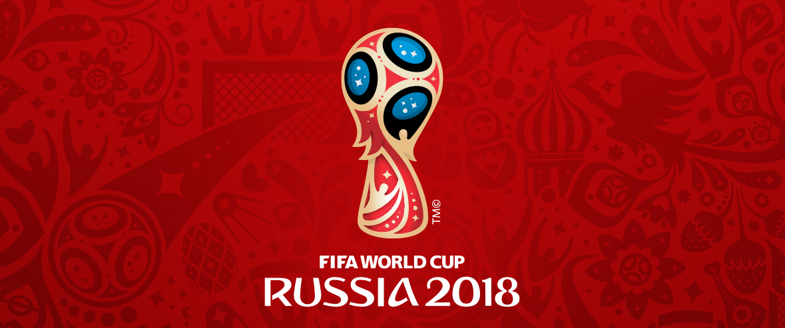

<!-- [id]: russia09.png -->

```{r setup, include=FALSE}
library(flexdashboard)
library(shiny)
library(png)
options(warn = 0)
```

<!-- Sidebar {.sidebar data-width=320} -->
<!-- ======================================================================= -->
<!-- ```{r fig.width=3.15, fig.height=6.35,echo=FALSE}
library(jpeg)
library(png)
library(grid)
# img <- readJPEG("russia01.jpg")
img <- readPNG("russia02.png")

grid.raster(img)
 # img(src='russia03.png', align = "center")
<!-- ``` -->

Sidebar {.sidebar data-width=200}
=======================================================================
```{r fig.width=.5, fig.height=.5,echo=FALSE}
library(jpeg)
library(grid)
# img <- readJPEG("russia01.jpg")
# img <- readJPEG("Sigueme03.jpg")
img <- readPNG("Sigueme05.png")

grid.raster(img)
```


Fase de grupos
=======================================================================

Row {data-height=350}
-----------------------------------------------------------------------
<!-- ```{r fig.width=20, fig.height=4,echo=FALSE}
library(jpeg)
library(png)
library(grid)
# img <- readJPEG("russia01.jpg")
# img <- readPNG("russia07.png")
# img <- readJPEG("Sigueme02.jpg")
# img <- readJPEG("russia05.jpg")

# grid.raster(img)
 img(src='russia09.png', align = "center")
<!-- ``` -->
<!-- {#id .class width=1200 height=320px} -->
<!-- { width=100% height=30% } -->
[{#id .class width=1150 height=270px}](http://www.fifa.com/worldcup/)
<!-- {#id .class width=1150 height=300px} -->
<!-- {#id .class width=1150 height=300px} -->
<!-- http://www.squawka.com/news/world-cup-2018-russias-stadiums-in-pictures/201955#2oEbD5Hqu7cCUy2y.97 -->

Row {data-height=250} {.tabset}
-----------------------------------------------------------------------

### Grupo A

```{r}

```


### Grupo B

```{r}

```

### Grupo C

```{r}

```

